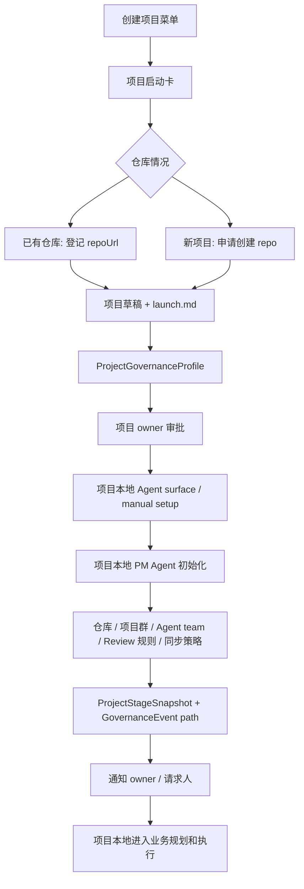

# Agent Hub Product Workflows

## Product Principle

Agent Hub is not a command list, not a central engineering executor, and not the business project manager for every project.

It is the front door for:

- project adoption of company Agent rules;
- knowledge engineering intake;
- Agent capability and tool capability feedback;
- governance event intake;
- knowledge queries;
- stage-level project status.

Canonical boundary: [Central Knowledge And Agent Governance Target](../strategy/central-knowledge-agent-governance-target.md).

Each menu action should follow one closed loop:

```txt
Intent
-> deterministic Agent Hub intake
-> safety gate
-> intake card
-> user confirmation
-> project adoption, knowledge intake, governance event, capability gap, tool gap, or safe central action
-> central governance dispatch only when central capability work is needed
-> project/Agent/tool/knowledge/governance state update
-> next action
```

The first implementation can return text cards. Feishu interactive cards should use the same fields and actions when card callbacks are enabled.

## Deterministic Intake Layer

Feishu remains the entrance. Agent Hub uses deterministic intake rules for high-confidence actions and hands material processing to the Codex Worker result contract.

Agent Hub should:

- classify intent;
- extract fields;
- ask clarification when required fields are missing;
- draft reply/card content;
- recommend safe tool calls or task creation.

Agent Hub should not directly execute engineering work, publish verified knowledge, modify permissions, reveal secrets, delete content, or bypass review. Those actions must become server-side validated actions, approval flows, local project Agent actions, or central governance tasks.

## Create Project

Creating a project in central means registering that a real project adopts company Agent capability, tool policy, quality gates, and high-signal sync. It does not mean central owns the project's business backlog.

### Two Paths

| Path | User Situation | Required Outcome |
| --- | --- | --- |
| Existing repository | Team already has code or a repo | Register project adoption, bind repo, install or verify `.zhenzhi/` governance surface, bind group, attach Agent rules |
| New repository | Project starts from zero | Register project adoption, request repo creation, initialize local Agent surface, create project group, attach Agent rules |

### Intake Card

Fields:

| Field | Required | Notes |
| --- | --- | --- |
| projectName | yes | Human-readable name |
| projectOwner | yes | Human owner, not an Agent |
| projectGoal | yes | What the project should achieve |
| repoMode | yes | `existing` or `new` |
| repoUrl | required when existing | Git URL |
| repoName | system-generated | New repo: generated from project name. Existing repo: inferred from Git URL. Do not ask the user to type it unless conflict resolution is needed. |
| createProjectGroup | recommended | Whether to create or bind Feishu project group |
| requestedAgents | recommended | PM, product, frontend, backend, ops, knowledge, etc. |
| initialTools | optional | Project-private tools or common tools |
| dueDate | optional | First milestone |
| syncPolicy | recommended | Git snapshot cadence and urgent governance event path |

Card buttons:

| Button | Action |
| --- | --- |
| 补充信息 | Ask for missing fields |
| 生成启动卡 | Create project adoption draft and launch checklist |
| 发起审批 | Submit project init approval |
| 创建/绑定项目群 | After approval, create or bind Feishu group |
| 处理仓库 | Existing repo: inspect/init. New repo: create repo through approved integration |
| 组建 Agent 团队 | Create local project Agent roster proposal and adopted rule set |

### Execution Flow



### Startup Milestones

Project creation does not invent a product roadmap. It creates startup milestones only:

| Milestone | Meaning | Owner |
| --- | --- | --- |
| M0 Intake Complete | required intake fields are captured or marked missing | Agent Hub |
| M1 Approval And Ownership | human project owner and approval path are clear | Human owner + Project Manager Agent |
| M2 Initialization Executed | repo, group, default Agent team, Runner, and Review rules are ready or blocked | Project Manager Agent |
| M3 Local Agent Surface Ready | local business planning can run in the project repo; high-signal sync path exists | Project Manager Agent |

Business milestones, product delivery dates, and engineering sprint plans are proposed later by the project-local PM/Product Agents, then confirmed by the human project owner. They are not centrally generated by Agent Hub.

### Agent Team Entry

Every project starts with a minimal default team:

| Agent | Joins By Default | Role |
| --- | --- | --- |
| `agent.<project>.project-manager` | yes | initialization owner, scope and task flow |
| `agent.company.product-manager` | yes, unless intake clearly excludes product work | product requirement clarification and acceptance criteria |
| `agent.<project>.knowledge-engineering` | yes | project material and reusable knowledge drafts |
| `agent.<project>.executor` | yes | local execution in the project repo through Codex, Claude, local tools, Agent Ring, or manual runner |

Product requirement clarification must not be assigned to the generic Project Manager Agent. It needs either `agent.company.product-manager` or a named human product owner. A project-scoped actor such as `agent.<project-id>.product-manager` may execute the task, but the company-level role identity stays `agent.company.product-manager`. Agent Hub decides this during first intake: include Product Manager Agent by default; skip it only when the user explicitly says requirements are already clear, the work is only technical/repository migration, or product is not needed. The skip reason is recorded in `launch.md`; no separate confirmation task is created.

Default Product Manager Agent responsibilities and skill pack are defined in [Product Manager Agent Role And Skill Pack](product-manager-agent-role-and-skill-pack.md).

Requested roles such as frontend, backend, test, ops, growth, or domain expert do not automatically become durable Agents just because the user typed them once. They become candidate local project Agents or local backlog items. The project-local Project Manager Agent confirms actual need, available local tools, permissions, and owner approval before attaching more Agents.

### After Creation Flow

```txt
Project draft + launch.md
-> ProjectGovernanceProfile
-> local .zhenzhi/ governance surface
-> Project Manager Agent local initialization or manual setup
-> ProjectStageSnapshot
-> local business planning and execution
-> central receives only high-signal records
```

### Closed Loop Contract

Project creation is closed only when the project can run locally without the intake requester holding hidden state, and central knows how the project will report high-signal records.

Owner:

- The generated `agent.<project>.project-manager` is the default Project Initialization Agent.
- Human project owner remains accountable for scope, approval, and final project direction.
- Agent Hub only collects intent and fields. It does not own project execution.
- Project-local Agents own business planning and execution.
- Central Scheduler owns only governance, knowledge, Agent capability, and tool capability follow-ups.

Required durable records:

- `Project` draft.
- `launch.md` with owner, goal, repo mode, group plan, default Agent team, sync policy, and M0-M3 startup milestones.
- `ProjectGovernanceProfile`.
- local `.zhenzhi/` governance surface or blocker.
- project Agent roster.
- approval request when owner approval is required.
- `ProjectStageSnapshot` or manual handoff record after initialization work.
- notification to requester/project owner with result, risks, blockers, and next action.

Done means:

- existing repo was inspected or new repo creation was requested through approved integration;
- README, AGENTS, project structure, Review rules, and project context are initialized or listed as blockers;
- Feishu project group is created, bound, or explicitly marked unnecessary;
- Agent team has role boundaries and allowed project scope;
- high-signal sync paths exist for stage snapshots, governance events, knowledge candidates, Agent gaps, and tool gaps;
- local business backlog ownership is explicit in the project repo;
- reusable knowledge, policy, tool, or permission changes enter the correct Review path.

## Agent Team

Purpose: decide which Agents enter the project and what each one owns.

Intake fields:

| Field | Required |
| --- | --- |
| projectId/name | yes |
| phase | yes |
| goal | yes |
| expectedOutput | yes |
| existingMembers | optional |
| constraints | optional |

Output:

- Recommended Agents.
- Role boundaries.
- Collaboration order.
- Required tools and skills.
- Approval or risk items.
- First task list.

## Knowledge Search

Purpose: answer from verified knowledge only.

Flow:

```txt
Question
-> retrieve verified knowledge
-> answer with source
-> if no reliable answer, ask whether to create a knowledge gap or submit source material
```

Card actions:

- 换关键词.
- 提交资料.
- 创建知识缺口.
- 召唤知识工程 Agent.

## Knowledge Capture

Purpose: turn project material into reviewable knowledge.

Flow:

```txt
Raw material
-> SourceMaterial draft
-> KnowledgeTask
-> scheduler assignment
-> Agent Ring runner processing through local Codex / Claude / model / tool
-> TaskResult + KnowledgeItem draft
-> Knowledge Engineering Agent review sub-agent gate
-> requester notification
-> human approval when needed
-> reusable knowledge
```

Card actions:

- 作为项目资料保存.
- 作为通用知识保存.
- 补充来源.
- 派发给负责人处理.
- 查看任务状态.
- 进入 Review.

Meeting note example:

```txt
提交人发送会议纪要
-> Agent Hub 返回: 已接收，任务 KT-xxx
-> Scheduler 匹配 Agent Ring Runner
-> Runner claim 任务并拉取上下文
-> Runner 驱动本机 Codex / Claude / 模型处理
-> Runner 写回 TaskResult
-> Agent Hub 通知提交人任务结果
```

The bot should preserve the original source and task trail. It should not pretend a small router model has deeply understood long or sensitive material.

## Tool Or Skill Request

Purpose: register a reusable capability without mixing up tool execution and result storage.

Flow:

```txt
Tool/skill intake
-> ToolAsset / SkillAsset draft
-> risk classification
-> Tool request task when owner work is needed
-> owner review
-> approval
-> project/common availability
```

Card actions:

- 保存草稿.
- 标记公司通用.
- 标记项目私有.
- 发起 owner 审批.

## Project Group Binding

Purpose: turn a Feishu group into project assistant mode.

Required confirmations:

- Project ID.
- This group is the official project group.
- Project owner or group owner agrees.
- Whether to invite selected Agents.

After binding:

- Group messages can become project material drafts.
- Agent summons default to this project.
- Review queue and handoff use project context.

## Project Handoff

Purpose: make project transfer operational, not just a summary.

Handoff card fields:

| Field | Required |
| --- | --- |
| projectId | yes |
| currentPhase | yes |
| receiver | yes |
| handoffScope | yes |
| remainingTasks | recommended |
| permissionsToClose | recommended |
| operatingGoal | recommended |

Output:

- Handoff draft.
- Handoff task.
- Source material list.
- Decision and lesson links.
- Open risks.
- Permission changes.
- Next owner confirmation.
