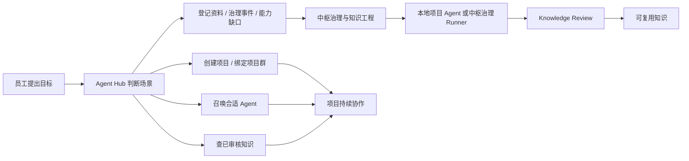
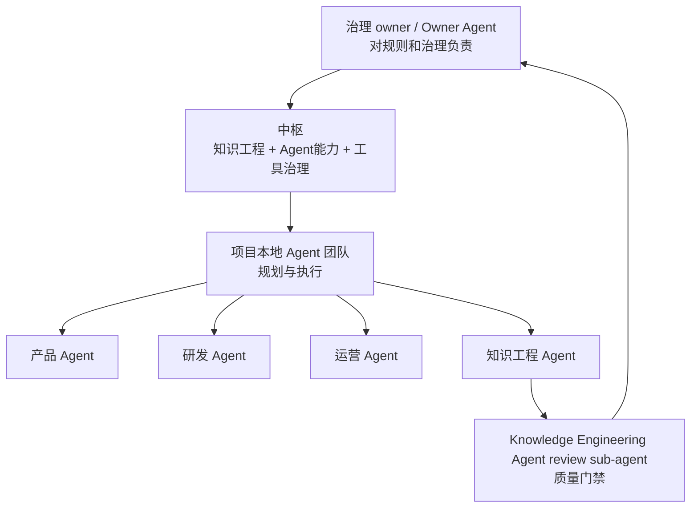

# 桢知 Agent Hub 使用手册

## 你可以把它当成什么

桢知 Agent Hub 是公司知识工程、Agent 能力治理、工具治理和项目采用入口。

它不是一个普通问答机器人，不是只查文档的搜索框，也不是替所有项目做业务规划和工程执行的中央项目经理。它的工作是把请求交给中央处理器：登记项目采用、登记资料、接收治理事件、沉淀知识、建设 Agent 能力和治理工具。

| 你的情况 | Agent Hub 会帮你做什么 |
| --- | --- |
| 我有一个新想法，不知道怎么开始 | 判断是否需要立项，生成项目采用草稿，提示项目负责人和项目群 |
| 我需要产品、研发、运营、知识工程 Agent 一起干活 | 建议项目本地应该带哪些 Agent，生成待确认的分工和规则采用 |
| 我想查公司已有经验 | 只从已审核知识里找答案，并返回来源 |
| 我手里有会议纪要、资料、踩坑经验、外部文章链接 | 登记原始材料；只有跨项目知识、治理异常、Agent/工具缺口进入中枢处理 |
| 我想用一个工具或技能 | 生成 ToolAsset / SkillAsset 候选，进入 owner 审批 |
| 我想改 Skill、Workflow、AGENTS 或规则 | 先保存来源和问题，生成变更候选，评审/审批通过后才合入体系 |
| 项目做完要交给运营或另一个团队 | 整理交接清单、资料范围、待办和权限关闭建议 |

## 为什么要用它

不用 Agent Hub，工作容易散在聊天记录、个人脑子、临时文档和代码仓库里。结果是新人找不到资料，Agent 重复踩坑，项目结束后经验没有沉淀。

使用 Agent Hub 后，项目采用、Agent、工具、资料、可复用知识、治理事件、审批和审计会进入同一套可追踪流程。普通业务任务仍留在项目本地。



## 两种使用场景

同一个飞书机器人，在不同地方会表现成不同角色。

| 使用位置 | 它是谁 | 适合做什么 |
| --- | --- | --- |
| 私聊机器人 | 公司 Agent Hub | 创建项目、组建 Agent 团队、查公司知识、申请工具或技能 |
| 项目群里 @ 机器人 | 项目助手 | 登记项目资料、提交阶段快照、提交治理事件、召唤项目内 Agent、项目交接、看阶段状态 |

飞书自定义菜单不能按私聊和群聊分别配置，所以菜单是统一的。你点同一个菜单时，机器人会根据“私聊还是群聊”给出不同引导。

## 第一次使用

### 如果你要发起一个项目

先私聊 Agent Hub，直接发：

```text
我想做一个 GEO 项目，需要产品和研发一起推进，应该怎么组项目？
```

Agent Hub 会先给你项目组建议。如果已经确定要启动项目，需要分两种情况。

已有仓库接入：

```text
创建项目：项目名称 桢知 GEO 增长项目，项目负责人 梅晓华，已有仓库 https://github.com/company/geo-growth.git，项目目标 提升 GEO 内容生产和评估效率，需要Agent 产品/后端/知识工程，创建项目群 是
```

从头创建新项目：

```text
创建项目：项目名称 桢知 GEO 增长项目，项目负责人 梅晓华，新建仓库 zhenzhi-geo-growth，项目目标 搭建 GEO 增长工作台，需要Agent 产品/前端/后端/运营/知识工程，创建项目群 是
```

它会生成项目草稿、启动清单和审批路径。项目成立后，可以把机器人拉进项目群，并发送：

```text
绑定项目群：项目 <项目名称>
```

启动清单会覆盖这些事项：

| 事项 | 已有仓库 | 新建仓库 |
| --- | --- | --- |
| 知识工程项目卡 | 创建 | 创建 |
| 代码仓库 | 登记并检查初始化 | 审批后创建并初始化 |
| README / AGENTS | 检查缺口并补齐 | 初始化生成 |
| 项目群 | 创建或绑定 | 创建或绑定 |
| Agent team | 按阶段编组 | 按阶段编组 |
| 工具/技能 | 识别已有工具和缺口 | 识别需要申请的工具和技能 |
| 审批 | 项目 owner 确认 | 项目 owner 确认，仓库创建也要受控 |

项目初始化由项目本地项目经理 Agent 收口。它负责确认范围、里程碑、仓库、项目群、Agent team、Review 规则、同步策略、风险和下一步。初始化完成后，它必须写出项目本地 `.zhenzhi/` 治理面、阶段快照或人工接管记录，并通知项目 Owner 和请求人；否则项目不能算真正启动。

创建项目时不会替你编业务里程碑。系统只生成启动里程碑：

- M0：信息收齐或缺口明确。
- M1：Owner 和审批路径明确。
- M2：仓库、项目群、默认 Agent team、Review 规则、同步策略已准备或阻塞原因明确。
- M3：项目本地 Agent 治理面已准备，业务规划可在项目仓库本地运行。

默认加入的 Agent 是项目经理 Agent、产品经理 Agent、知识工程 Agent、执行 Agent。只有当你明确说明需求已拆清、仅做技术/仓库迁移或不需要产品时，系统才跳过产品经理 Agent，并把原因写进启动卡。产品需求澄清由产品经理 Agent 或明确的人类产品 Owner 承接。你填写的前端、后端、测试、运营等角色会先进入候选清单；项目经理 Agent 会在项目本地确认哪些真的要加入，哪些只需要变成本地 backlog。

项目创建后会这样往下流转：

```txt
项目草稿
-> 项目治理采用配置
-> 项目本地 .zhenzhi/ 治理面
-> 项目经理 Agent 本地初始化
-> 写出阶段快照 / 风险 / 同步策略
-> 项目本地生成业务 backlog
-> 中枢只接收阶段快照、治理事件、跨项目知识、Agent/工具缺口
```

项目运行后，项目经理 Agent 在项目本地持续跟进项目健康。中枢只读取低频阶段快照和高信号事件。如果出现审批/仓库/权限阻塞、产品决策缺失、质量门反复失败、安全风险、成本风险或可复用能力缺口，项目本地 Agent 才向中枢提交 `GovernanceEvent`、`AgentCapabilityGap` 或 `ToolCapabilityGap`。

### 如果你只是想查资料

直接问，不需要先学命令：

```text
查一下 Agent 工具申请为什么要经过 Review？
```

机器人只会用已审核知识回答，并告诉你来源。找不到可靠答案时，它会告诉你可以怎么补充材料，而不是编一个答案。

### 如果你要沉淀一段资料

在项目群里发：

```text
资料：项目 <项目名称>
今天确认：GEO 项目第一阶段先做站内内容结构化，不先做全渠道投放。
原因：当前缺少可复用的内容质量评估样本。
```

机器人会保存原始资料，并判断它是否值得进入可复用知识流程。只有跨项目知识候选、治理异常、Agent 能力缺口或工具能力缺口会进入中枢处理。草稿通过 Knowledge Review 后，才会成为可复用知识。

如果你只是看到一篇文章、一个链接、一个外部团队的做法，想让系统先研究，不需要写复杂命令。可以直接发：

```text
研究一下 https://example.com/article
```

也可以只发链接。机器人默认只做三件事：保存来源、判断是否有跨项目复用价值、必要时创建知识候选或治理任务。这个动作不需要审批，因为它没有改变 Skill、Workflow、AGENTS、权限或规则。

只有当你明确说：

```text
把这个融入体系
改一下 Skill
更新工作流
修改规则
```

才会进入体系变更流程。体系变更必须有来源、影响范围、评审和审批，不能因为一篇文章被保存就自动改掉公司规则。

会议纪要也一样：

```text
会议纪要：项目 知识工程
<粘贴纪要、转发飞书文档或发送妙记链接>
```

你会收到类似结果：

```text
已接收会议纪要。
任务编号：KT-20260618-001
执行节点：等待调度
状态：pending
处理完成后我会通知你。
```

## 菜单地图

建议给飞书机器人配置统一菜单。菜单只是快捷入口，不代表授权。

| 一级菜单 | 子菜单 | 发送文本 | 适合什么时候点 |
| --- | --- | --- | --- |
| 开始 | 新手引导 | 新手引导 | 不知道 Agent Hub 能做什么 |
| 开始 | 查知识 | 查知识 | 想检索公司已审核经验 |
| 项目 | 创建项目 | 创建项目 | 想立项或把想法变成项目 |
| 项目 | 绑定项目群 | 绑定项目群 | 把当前飞书群绑定到项目 |
| 项目 | 项目交接 | 项目交接 | 项目进入运营、移交或收尾 |
| Agent | 组建 Agent 团队 | 组建 Agent 团队 | 不确定要产品、研发、运营还是知识工程 Agent |
| Agent | 召唤 Agent | 召唤 Agent | 项目群里需要某个 Agent 参与 |
| 知识 | 记录资料 | 资料：项目 <项目名称>\n<内容> | 登记项目资料并创建调度任务 |
| 知识 | 会议纪要 | 会议纪要：项目 <项目名称>\n<内容> | 登记会议纪要并创建知识沉淀任务 |
| 知识 | 研究资料 | 研究一下 <链接或内容> | 保存外部资料并创建本机研究任务，不直接改体系 |
| 知识 | 待审核 | 待审核 | 看 Review 队列 |
| 权限 | 申请工具/技能 | 申请工具/技能 | 想登记或使用新工具、新技能 |
| 权限 | 申请工具/技能 | 申请工具/技能 | 需要登记工具、技能、模型、Agent Ring 接入或项目私有能力 |

## 常用话术

### 组建项目组

```text
我想做一个 <目标>，现在只有一个初步想法。请帮我判断是否要立项，需要哪些人和 Agent，第一阶段交付物是什么。
```

如果已经有项目：

```text
组建 Agent 团队：项目 <项目名称>，阶段 <需求/开发/运营/交接>，目标 <要完成什么>，期望输出 <方案/代码/内容/分析>，已有成员 <可选>
```

### 召唤 Agent

```text
为 <项目名称> 召唤 Agent。
当前阶段：需求梳理。
我需要的结果：产品方案、研发拆解、风险点。
```

### 沉淀经验

```text
沉淀：
我们发现 <场景> 下 <做法> 不可靠。
证据：<会议、实验、链接或负责人>。
适用范围：<哪些项目适用，哪些不适用>。
```

### 申请工具或技能

```text
申请工具/技能：
名称：<名称>
用途：<解决什么问题>
owner：<负责人>
适用项目：<项目或公司通用>
输入输出：<输入什么，输出什么>
风险：<是否会写数据、发消息、调用外部系统>
```

### 项目交接

```text
项目交接：
项目：<项目名称>
当前阶段：<阶段>
接手人/团队：<姓名或团队>
交接资料范围：<文档、代码、群、账号、待办>
需要关闭的权限：<权限列表>
```

## 安全边界

Agent Hub 可以帮你发起流程，但不能绕过 owner、权限和 Review。

| 事情 | 能不能直接做 | 正确流程 |
| --- | --- | --- |
| 查询已审核知识 | 可以 | 返回答案和来源 |
| 创建项目草稿 | 可以 | 草稿进入项目负责人确认 |
| 登记资料 | 可以 | 只有跨项目知识候选、治理事件、Agent/工具能力缺口进入中枢处理；Knowledge Review 后才能复用 |
| 调用普通工具 | 视工具注册和项目权限而定 | 工具调用和结果入库分开判断 |
| 把工具结果写入项目 | 不能默认写入 | 需要项目成员权限或 owner 允许 |
| 发布 verified / approved 知识 | 不能直接发布 | 需要 Knowledge Review，必要时人工审批 |
| 删除知识库、清空项目、改权限 | 不能直接执行 | 生成高风险申请，owner 审批后由受控流程处理 |
| 在群里发 token | 不能 | token 只能私聊发送给申请人 |

## 谁对结果负责

Agent Hub 可以识别意图、登记项目采用、记录阶段状态、接收治理事件、查知识和通知结果。具体业务规划和工程执行由项目本地 Agent 团队完成。中枢只调度知识工程、Agent 能力、工具治理和高风险治理事项。



AI native 公司里，owner 是治理责任位，不一定等于自然人执行者。当前知识工程项目的治理 owner 是梅晓华；长期可以演进为 Owner Agent，但权限、审核、风险动作和最终结果都必须可审计。

## 好用的标准

一次好的请求，通常包含四件事：

| 信息 | 示例 |
| --- | --- |
| 目标 | 我想做一个 GEO 项目 |
| 当前阶段 | 现在只有想法，还没有方案 |
| 约束 | 两周内要出第一版，先不接生产系统 |
| 期望输出 | 给我项目组建议、第一阶段任务和风险点 |

不需要写得很正式。你可以像跟项目经理说话一样说明背景，Agent Hub 会把它整理成流程里的结构化信息。

## Agent Ring 怎么工作

Agent Ring 是外部 Agent 工作台，安装在各台电脑或项目环境上。它注册这台电脑上的 Agent、工具、模型、仓库权限和资源。普通业务工作默认在项目本地执行；只有中枢治理任务才需要中央调度器分配给匹配的 Runner。

```txt
项目本地模式:
Agent Ring / Codex / Claude 在项目仓库执行
-> 本地保留普通任务和证据
-> 只向中枢提交阶段快照、治理事件、知识候选、Agent/工具缺口

中枢治理模式:
Scheduler 分配治理任务
-> Runner claim 和 lease
-> Runner 拉取治理上下文
-> Runner 写回治理结果
```

知识是否进入可复用库，还要看 Knowledge Review 结果。

## 常见问题

### 我应该私聊，还是在项目群里发？

新项目、跨项目、权限申请、访问凭证申请，优先私聊。已经有项目群的资料、会议、交接、项目内 Agent 协作，优先在项目群里 @ 机器人。

### 为什么我点了菜单，它还让我补充信息？

菜单只是快捷入口。机器人需要知道项目、负责人、阶段、目标、资料范围或风险，才能把事情放进正确流程。

### 为什么不能直接把群聊内容都变成知识？

群聊是原始材料，不等于可复用知识。可复用知识必须有来源、范围、置信度、适用边界和 Review。

### 为什么我上传会议纪要后不是立刻入库？

会议纪要通常需要上下文判断、证据引用和结构化整理。机器人会先登记 SourceMaterial；只有可复用知识、治理异常、Agent 能力缺口或工具缺口会进入中枢处理。

### 工具能用，为什么结果不能直接入库？

工具调用是一回事，结果能不能进入项目或知识库是另一回事。结果入库会影响后续复用，所以需要单独判断来源、质量、敏感性和审核路径。
