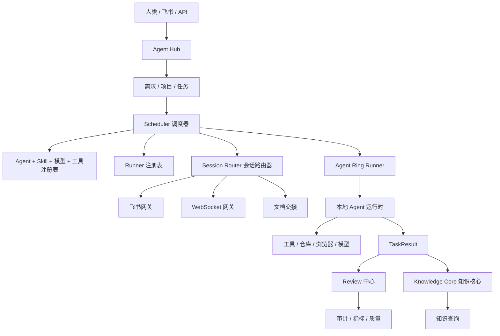

# 基于 Agent 工作模式文档整理的 AI Native OS 产品架构

## 来源

读取时间：2026-06-22

- 原始会议纪要：`GSqxdkbFOo3YMhxHSRZcSqofnbe`
- 提炼/转写文档：`DWiYdYLWQoNGwCxMneXcyRwzndh`

说明：原始文档中引用了一个白板，但当前 `lark-cli` 用户授权缺少 `docs:document.media:download`，所以本版本只基于文本内容整理，未纳入白板图像细节。

## 产品架构摘要

这两份文档描述的不是一组 prompt，而是一个 Agent 操作系统。

核心架构：

```txt
Agent 定义层
-> 角色 / Skill / 模型注册
-> 项目 Agent 配置
-> 资源与 Runner 注册
-> 调度与任务分发
-> 会话路由与通讯网关
-> 本地 Agent 运行时 / Agent Ring
-> 产物、上下文与知识交接
-> Review、审计、指标与治理
```

## 关键产品概念

### 1. Agent 是被定义的工作者，不是聊天提示词

每个 Agent 必须具备：

- 角色身份；
- 职责边界；
- 可用 Skill；
- 可用工具；
- 模型配置；
- 项目范围；
- 资源需求；
- 输出合同；
- 会话/运行模式。

产品含义：

Agent 定义必须成为一等产品对象。只有一段角色描述不够。

### 2. Skill 是绑定角色的能力包

会议里区分了通用 Skill 和角色专属 Skill。

产品规则：

- 产品经理 Agent 应只加载产品相关 Skill。
- 测试 Agent 应加载测试相关 Skill，必要时可使用更便宜或更专门的模型。
- 技术 Agent 不应加载全部产品、运营、设计 Skill。
- 项目级 Skill 可以覆盖或扩展公司通用 Skill。

产品含义：

平台需要 Skill Registry，至少包含：

- Skill 名称；
- 触发条件；
- 允许使用的角色；
- 项目范围；
- 模型需求；
- 所需工具；
- token 成本特征；
- 测试用例；
- 版本；
- 审批与发布状态。

### 3. 子 Agent 和独立 Agent 是运行模式

文档明确：子 Agent 模式和多个独立 Agent 工作模式都可行。

差异：

| 模式 | 含义 | 产品用途 |
| --- | --- | --- |
| 子 Agent | 在父会话内被拉起，开销更低，上下文更窄。 | 小任务、边界清楚的短任务。 |
| 独立 Agent | 有完整会话、记忆、产物和成长路径。 | 长周期角色工作、项目角色、可沉淀能力。 |

共同合同：

- 都需要角色定义；
- 都需要 Skill 限定；
- 都需要输出合同；
- 都需要任务/结果可追踪。

产品含义：

平台不能只硬编码一种 Agent 模式。需要 `AgentRuntimeMode` 字段和相应调度规则。

### 4. 项目必须有 Agent 配置

文档强调：不同项目要配置不同 Agent、Skill、模型和资源。

产品含义：

项目必须包含：

- Agent 名单；
- 角色到 Skill 的绑定；
- 每个角色的模型配置；
- 可用工具；
- Runner/资源需求；
- 上下文包；
- 通讯渠道；
- 升级处理负责人。

这能支持项目级初始化，避免浪费 token，也避免加载无关 Skill。

### 5. 资源管理需要中央调度

文档要求建立主调度机制，由主调度下发任务并管理资源。

产品含义：

Scheduler 是控制面组件。它必须知道：

- 已注册电脑/Runner；
- 可用 Agent；
- 每个 Runner 上可用的 Skill 和模型；
- 工具可用性；
- 项目访问权限；
- 当前负载；
- 租约状态；
- 任务优先级；
- 冲突和风险。

这直接对应 `AgentRunner` 注册表和 `taskRuntime`。

### 6. 电脑是被注册的执行资源

文档要求把电脑资源注册到系统中，让系统实时了解资源使用情况。

产品含义：

`Agent Ring Runner` 至少要包含：

- runner id；
- 机器负责人；
- 在线/离线状态；
- 心跳；
- 负载；
- 已安装本地 Agent / 工具 / 模型；
- 项目/仓库访问权限；
- 数据权限；
- 活跃会话；
- 活跃租约；
- 失败历史。

### 7. 会话通讯需要路由机制

文档提出：会话间通讯可以通过飞书或自建渠道实现，并抽象出类似网络路由的 Agent 路由机制。

产品含义：

平台需要 Session Router：

- session id；
- Agent id；
- project id；
- runner id；
- 通讯渠道；
- 路由表；
- 当前负责人；
- 交接目标；
- 投递状态；
- 兜底路径。

通讯渠道：

| 渠道 | 用途 |
| --- | --- |
| 飞书 | 简单通知、卡片、用户动作、轻量路由。 |
| 文档交接 | 大上下文和详细产物转移。 |
| 自建本地通道 | 本地会话之间通讯。 |
| WebSocket | 实时连接和转移控制。 |
| 服务器回调 | 灵活路由和跨电脑重新分配。 |

### 8. 跨电脑转移本质是路由问题

文档提到：机器人跨电脑转移可以通过修改 WebSocket 配置或回调到服务器实现。

产品含义：

不要把“转移”理解成移动一个机器人实体。它真正移动的是：

- 任务所有权；
- 会话路由；
- 上下文包；
- 产物引用；
- 租约；
- Runner 分配；
- 通讯端点。

架构流程：

```txt
Agent 会话状态
-> 更新路由表
-> 新 Runner 领取任务 / 租约
-> 拉取上下文包
-> 重新绑定通讯渠道
-> 旧路由关闭或挂起
-> TaskResult 写入转移记录
```

### 9. 服务器模式和 WebSocket 模式是产品选择

文档比较了服务器侧灵活性和 WebSocket 实时性。

产品架构应同时支持两类能力：

| 模式 | 优势 | 劣势 | 适用场景 |
| --- | --- | --- | --- |
| 固定/本地配置 | 简单，平台复杂度低。 | 灵活性差。 | 小团队、早期部署。 |
| WebSocket | 实时能力强。 | 动态路由变化频繁时不够灵活。 | 本地 Agent Ring、实时状态、会话控制。 |
| 服务器回调/控制 | 中央路由灵活。 | 服务器压力更大，运维复杂度更高。 | 较大组织、动态重新分配。 |

## 推荐产品架构

### A. 控制面

控制面负责持久状态和治理。

模块：

- 组织与管理后台；
- Agent 注册表；
- Skill 注册表；
- 模型配置注册表；
- 工具注册表；
- 项目注册表；
- 需求中心；
- 任务调度器；
- Runner 注册表；
- 会话路由器；
- Review 中心；
- 指标与审计。

### B. 执行面

执行面负责在分布式机器上完成具体工作。

模块：

- Agent Ring Runner；
- 本地 Agent 运行时；
- 本地工具适配器；
- 本地模型适配器；
- 仓库 / worktree 适配器；
- 浏览器 / 桌面自动化适配器；
- 上下文包拉取；
- `TaskResult` 写回。

### C. 通讯面

通讯面负责消息、卡片、会话事件和交接流转。

模块：

- 飞书网关；
- 卡片动作处理器；
- 文档交接服务；
- WebSocket 网关；
- 会话路由表；
- 通知服务；
- 投递 / 重试 / 修复。

### D. 知识与产物面

知识与产物面负责让来源、上下文、产物和可复用知识可追踪。

模块：

- `SourceMaterial`；
- `ContextPack`；
- `ArtifactRef`；
- `TaskResult`；
- `KnowledgeItem`；
- Knowledge Review；
- 图谱边抽取；
- 搜索与引用。

## 需要新增或强化的产品对象

当前产品包已有很多对象。这两份文档进一步要求新增或强化以下对象：

| 对象 | 用途 |
| --- | --- |
| `AgentRuntimeMode` | 表示 `sub_agent`、`independent_agent`、`local_builder`、`hosted_agent` 等运行模式。 |
| `ModelProfile` | 模型选择、成本档位、模态、能力、默认角色绑定。 |
| `RoleSkillBinding` | 定义某个角色在某个项目下可以加载哪些 Skill。 |
| `ProjectAgentConfig` | 项目级 Agent 名单、Skill、工具、模型配置、Runner 需求。 |
| `SessionRoute` | Agent 会话、渠道、Runner、项目、负责人之间的路由表记录。 |
| `AgentSession` | 独立 Agent 或子 Agent 执行过程中的会话/运行状态。 |
| `TransferRecord` | 跨电脑/跨会话转移事件及原因。 |
| `ResourceReservation` | 任务执行所需 Runner/资源预约记录。 |
| `CommunicationChannel` | 飞书、文档、本地通道、WebSocket、callback 等通讯渠道。 |

## 主要产品流程

### 1. 定义 Agent

```txt
创建角色
-> 绑定职责
-> 绑定 Skill 白名单
-> 绑定模型配置
-> 绑定工具权限
-> 绑定输出合同
-> 审批 / 激活
```

### 2. 配置项目 Agent 团队

```txt
项目创建
-> 选择所需角色
-> 绑定角色 Skill
-> 绑定模型配置
-> 绑定工具和知识范围
-> 选择 Runner / 资源需求
-> 生成项目上下文包
```

### 3. 分发任务

```txt
ProjectTask
-> taskRuntime
-> 所需角色 / Skill / 工具 / 模型 / 资源
-> Scheduler 选择 Runner
-> Runner 领取租约
-> 拉取上下文包
-> 本地 Agent 执行
-> TaskResult 写回
```

### 4. 跨会话通讯

```txt
Agent / 用户消息
-> 会话路由器
-> 查询路由表
-> 选择通讯渠道
-> 卡片 / 文档 / WebSocket / callback 投递
-> 投递状态与重试
```

### 5. 跨电脑转移 Agent 工作

```txt
发起转移
-> 冻结或总结当前会话
-> 创建转移记录
-> 更新路由
-> 新 Runner 领取
-> 新上下文包
-> 继续执行
-> 旧会话关闭或挂起
```

## 架构图



## 与现有 AI Native OS 产品包的关系

这份架构对现有完整上线产品包做了补充：

- `Agent Team Manager` 需要包含角色-Skill-模型绑定。
- `Scheduler` 需要包含资源预约、模型匹配和工具匹配。
- `Agent Ring Console` 不应只显示 Runner 心跳，还要显示会话状态和转移状态。
- `Notification Center` 应升级为更大的 Session Router 的一部分。
- `Skill Registry` 需要支持项目级和角色级 Skill 范围。
- `Admin Console` 需要管理模型配置和通讯路由。

## 需要新增或强化的产品需求

| 领域 | 需求 |
| --- | --- |
| Agent 注册表 | Agent 必须声明运行模式、模型配置、Skill 白名单、工具白名单、输出合同。 |
| Skill 注册表 | Skill 必须支持角色/项目范围，避免 token 浪费和误加载。 |
| 模型注册表 | 角色可指定默认模型和兜底模型；测试 Agent 可在允许时使用更低成本模型。 |
| 项目配置 | 项目必须绑定 Agent、Skill、模型、工具、Runner 和上下文包。 |
| 资源注册表 | 电脑/Runner 必须注册能力、负载、会话、工具、模型和项目访问权限。 |
| 会话路由器 | 系统必须按 Agent、项目、会话、渠道、Runner 路由消息。 |
| 通讯网关 | 飞书、文档交接、WebSocket、callback、本地通道必须共享路由状态。 |
| 转移机制 | 跨电脑转移必须更新路由、租约、上下文和 `TaskResult` 追踪。 |
| 治理 | Skill / 模型 / 工具变更必须有负责人、测试、审批和审计。 |

## 待澄清问题

- 哪些 Agent 默认应该使用子 Agent 模式，哪些必须是独立 Agent？
- 模型配置应该由角色、项目、任务类型还是调度策略控制？
- 飞书只作为用户入口，还是也作为 Agent-to-Agent 的主要通讯渠道？
- Agent 跨电脑转移时必须转移哪些状态：完整转写、摘要、产物、上下文包，还是全部？
- 路由表应该存在中央处理器、Agent Ring 服务端，还是两边都需要？
- 需要达到什么实时性水平后，WebSocket 才变成必选能力？
